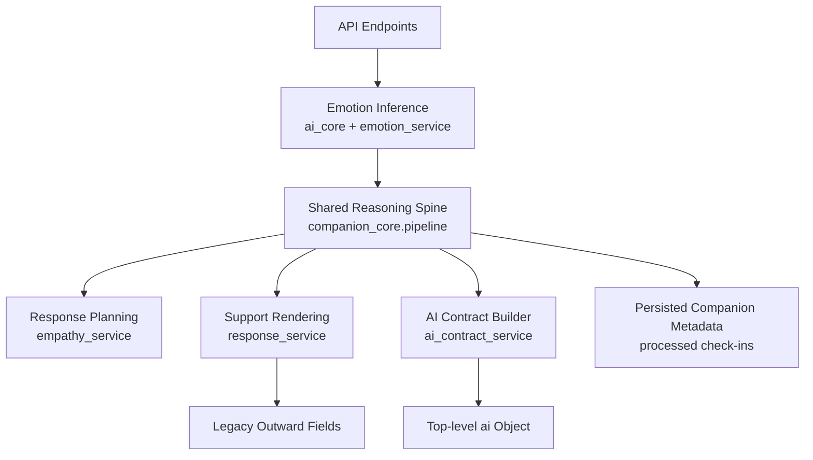
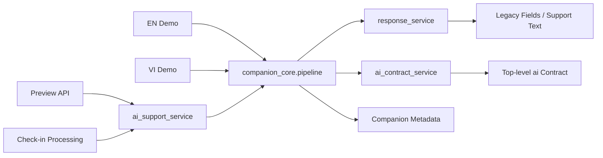
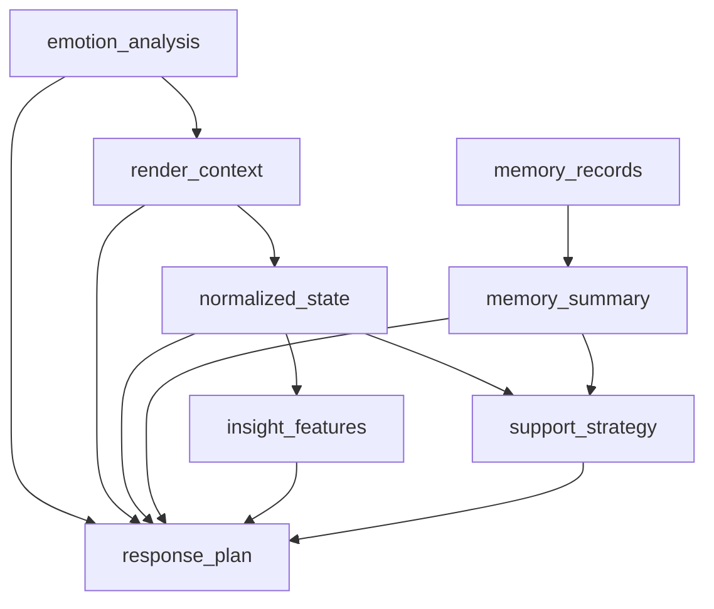

# Current AI architecture report

## 1. Executive summary

- The backend now has a single shared internal reasoning spine centered on `backend/app/services/companion_core/`, and that spine is used by preview, processed check-ins, and both English and Vietnamese demo flows.
- The production-facing preview path is `backend/app/api/me.py` -> `backend/app/services/ai_support_service.py` -> `companion_core` -> `backend/app/services/response_service.py`.
- Processed check-ins use the same reasoning path via `backend/app/services/checkin_processing_service.py`, then persist both legacy fields and shared companion metadata into `response_metadata_text`.
- English and Vietnamese demo payloads both use `build_companion_pipeline(...)`, but their renderer adapters remain language-specific in `backend/app/services/en_demo_service.py` and `backend/app/services/vi_demo_service.py`.
- Emotion inference remains separate from reasoning orchestration: raw emotion signals come from `backend/app/services/ai_core/*`, are normalized by `backend/app/services/emotion_service.py`, then fed into the companion pipeline.
- The outward API now exposes a new additive top-level `ai` object on preview and processed check-in responses while preserving all legacy top-level AI fields for backward compatibility.
- Provider usage is layered: local/Hugging Face and heuristic fallbacks for emotion inference; mock/template/OpenAI/Gemini/safety-template for supportive rendering; Gemini is currently demo-oriented rather than the default production preview renderer.
- Rendering fallback behavior is explicit in code. Medium/high risk always uses the safety template; English demo can attempt Gemini and fall back to `template_fallback` with debug observability when debug is enabled.
- Test coverage is meaningfully improved for preview/check-in AI behavior, companion pipeline logic, and demo provider behavior. The test harness is intentionally deterministic and offline-safe.
- The architecture is materially more coherent than before, but still transitional in outward contract convergence, memory durability, and provider operational maturity.

## 2. Scope and methodology

- This report is based on direct inspection of the current repository state, including:
  - API entrypoints under `backend/app/api/`
  - service modules under `backend/app/services/`
  - outward schemas under `backend/app/schemas/`
  - focused test coverage under `backend/tests/`
- The report specifically inspected:
  - `backend/app/services/companion_core/`
  - `backend/app/services/ai_support_service.py`
  - `backend/app/services/checkin_processing_service.py`
  - `backend/app/services/en_demo_service.py`
  - `backend/app/services/vi_demo_service.py`
  - `backend/app/services/response_service.py`
  - `backend/app/services/emotion_service.py`
  - `backend/app/services/empathy_service.py`
  - `backend/app/services/ai_contract_service.py`
  - relevant schema and API files
- This report describes the architecture as implemented today. It does not claim:
  - production traffic levels
  - benchmark quality beyond what is directly represented in code and tests
  - persistence guarantees for demo memory beyond the code currently present
  - operational readiness of third-party provider credentials in any given deployment
- Where behavior is inferred from code composition rather than directly proven by tests, that is stated explicitly.

## 3. System overview

The current AI system is organized into three main layers:

- Emotion inference:
  - text/audio emotion signals originate in `backend/app/services/ai_core/`
  - `backend/app/services/emotion_service.py` converts those signals into a normalized application-facing `emotion_analysis`
- Shared reasoning/orchestration:
  - `backend/app/services/companion_core/pipeline.py` constructs render context, normalized emotional state, memory summary, insight features, support strategy, and an enriched response plan
- Rendering and outward contracts:
  - `backend/app/services/response_service.py` renders supportive text using mock/template/OpenAI/Gemini/safety paths
  - `backend/app/services/ai_contract_service.py` lifts stable internal outputs into the outward additive `ai` contract

High-level architecture:

## 4. Request flow map

### Preview

- Entry point: `POST /v1/me/respond-preview` in `backend/app/api/me.py`
- Flow:
  - auth and preference lookup
  - `build_support_package(...)` in `backend/app/services/ai_support_service.py`
  - `detect_safety_risk(...)`
  - `tag_topics(...)`
  - `analyze_emotion(...)`
  - `build_companion_pipeline(...)`
  - `generate_supportive_response(...)`
  - `build_ai_contract(...)`
  - response serialization via `RespondPreviewResponse`

### Processed check-in

- Entry points:
  - `POST /v1/checkins/{entry_id}/process`
  - `POST /v1/checkins/{entry_id}/process-async`
  - `POST /v1/checkins/{entry_id}/reprocess`
  - `GET /v1/checkins/{entry_id}`
  - all in `backend/app/api/checkins.py`
- Flow:
  - transcription via `backend/app/services/stt_service.py`
  - `build_support_package(...)`
  - legacy field persistence on `JournalEntry`
  - companion metadata persistence in `response_metadata_text`
  - outward response assembled by `serialize_entry(...)`
  - additive `ai` object assembled by `build_ai_contract(...)`

### English demo

- Entry point: `POST /v1/demo/ai-core` in `backend/app/api/demo.py`
- Routing: `backend/app/services/demo_service.py`
  - English/default path -> `build_en_demo_payload(...)`
- Flow:
  - language normalization to English unless Vietnamese is explicitly detected
  - `detect_safety_risk(...)`
  - `tag_topics(...)`
  - `analyze_emotion(...)`
  - `build_companion_pipeline(...)` with an English-specific emotion postprocessor
  - for low-risk requests, attempt Gemini render via `render_supportive_response(..., provider_override="gemini")`
  - on provider failure, fallback to local English template text
  - optional debug object when `ai_render_debug` or internal debug mode is enabled

### Vietnamese demo

- Entry point: `POST /v1/demo/ai-core` in `backend/app/api/demo.py`
- Routing: `backend/app/services/demo_service.py`
  - Vietnamese path -> `build_vi_demo_payload(...)`
- Flow:
  - Vietnamese-only guardrails enforced in `vi_demo_service.py`
  - `detect_safety_risk(...)`
  - `tag_topics(...)`
  - `analyze_emotion(...)`
  - `build_companion_pipeline(...)` with Vietnamese short-event emotion adjustment
  - optional Gemini render attempt for low-risk cases
  - fallback to Vietnamese template text on provider error

One simplified flow diagram:

## 5. Core modules and responsibilities

### API layer

- `backend/app/api/me.py`
  - owns preview response assembly
  - exposes both legacy fields and the additive `ai` object
- `backend/app/api/checkins.py`
  - owns check-in upload/process/reprocess/retrieve endpoints
  - delegates AI work to `checkin_processing_service`
- `backend/app/api/demo.py`
  - exposes demo AI endpoint
  - also exposes weekly insight demo endpoint
- `backend/app/api/resources.py`
  - not part of the AI reasoning system
  - exposes static crisis resource data

### Shared orchestration

- `backend/app/services/companion_core/pipeline.py`
  - central internal orchestrator
  - constructs:
    - `render_context`
    - `normalized_state`
    - `memory_summary`
    - `insight_features`
    - `support_strategy`
    - enriched `response_plan`
- `backend/app/services/companion_core/render_context.py`
  - derives utterance/event/social context from transcript and topic tags
- `backend/app/services/companion_core/emotion_understanding.py`
  - converts `emotion_analysis` + render context into `NormalizedEmotionalState`
- `backend/app/services/companion_core/feature_extraction.py`
  - produces frontend-safe insight flags from normalized state
- `backend/app/services/companion_core/strategy_engine.py`
  - selects support strategy based on state plus optional memory summary
- `backend/app/services/companion_core/memory_summary.py`
  - summarizes recent memory records into recurring patterns and directional context
- `backend/app/services/companion_core/insight_engine.py`
  - builds weekly insight summaries from memory records
- `backend/app/services/companion_core/memory_store.py`
  - defines memory store abstraction
  - currently includes:
    - `NoOpEmotionalMemoryStore`
    - `InMemoryEmotionalMemoryStore`

### Production-like support path

- `backend/app/services/ai_support_service.py`
  - production-facing wrapper around the shared companion pipeline
  - builds the support package used by preview and processed check-ins
- `backend/app/services/checkin_processing_service.py`
  - applies the support package to persisted entries
  - stores both legacy fields and companion metadata
  - serializes processed entries and builds additive `ai`

### Demo adapters

- `backend/app/services/en_demo_service.py`
  - English demo adapter over the shared pipeline
  - contains English-specific render adjustments and Gemini debug observability
- `backend/app/services/vi_demo_service.py`
  - Vietnamese demo adapter over the shared pipeline
  - retains Vietnamese-specific short-event emotion adjustment and Vietnamese template text
- `backend/app/services/demo_service.py`
  - top-level demo router between English and Vietnamese
  - current weekly-insight routing always resolves to English weekly insight, which appears intentional in code but should be treated as a limitation

### Emotion and response services

- `backend/app/services/emotion_service.py`
  - converts raw model results from `ai_core` into application-facing `emotion_analysis`
  - derives:
    - `emotion_label`
    - `dominant_signals`
    - `social_need_score`
    - `response_mode`
- `backend/app/services/empathy_service.py`
  - builds the response plan from emotion/risk state
- `backend/app/services/response_service.py`
  - owns supportive renderer/provider abstraction
  - supports:
    - mock/template behavior
    - OpenAI renderer
    - Gemini renderer
    - safety template override for medium/high risk
- `backend/app/services/ai_contract_service.py`
  - normalizes internal companion outputs into the stable additive `ai` contract

### Outward schemas

- `backend/app/schemas/checkin.py`
  - preview and processed check-in request/response models
  - defines `AIContractResponse` and all nested submodels
- `backend/app/schemas/demo.py`
  - demo request/response models
  - exposes `ai_core` detail block for demos
  - exposes optional public `debug` block for English demo debug mode

## 6. Shared reasoning pipeline

`companion_core` is now the main shared orchestration layer for preview, processed check-ins, English demo, and Vietnamese demo.

Pipeline steps in `backend/app/services/companion_core/pipeline.py`:

1. Detect render context
- input:
  - transcript
  - topic tags
  - optional `context_tag`
- implementation:
  - `detect_render_context(...)`
- output:
  - `RenderContext`

2. Apply optional emotion postprocessing
- input:
  - current `emotion_analysis`
  - `RenderContext`
- usage:
  - English demo uses an English-specific render adjustment adapter
  - Vietnamese demo uses `_maybe_adjust_short_event_emotion(...)`
- output:
  - effective `emotion_analysis`

3. Build normalized emotional state
- input:
  - effective `emotion_analysis`
  - render context
  - topic tags
  - risk level
- implementation:
  - `build_normalized_emotional_state(...)`
- output:
  - `NormalizedEmotionalState`

4. Build memory summary
- input:
  - `memory_records` or empty list
- implementation:
  - `build_memory_summary(...)`
- output:
  - `MemorySummary`

5. Extract insight features
- input:
  - normalized state
- implementation:
  - `extract_insight_features(...)`
- output:
  - `InsightFeatures`

6. Select support strategy
- input:
  - normalized state
  - optional memory summary
- implementation:
  - `select_support_strategy(...)`
- output:
  - `SupportStrategy`

7. Build response plan
- input:
  - transcript
  - effective emotion analysis
  - topic tags
  - risk level
  - optional recent trend
- implementation:
  - `build_response_plan(...)` in `backend/app/services/empathy_service.py`
- output:
  - base response plan, then enriched with:
    - `render_context`
    - `normalized_state`
    - `support_strategy`
    - `memory_context`
    - `insight_features`

This means the shared reasoning spine today is:

## 7. Provider and rendering architecture

### Emotion inference architecture

The emotion inference stack is distinct from the companion reasoning layer.

- Entry point:
  - `backend/app/services/ai_core/text_emotion_service.py`
- Selection order:
  1. canonical models via `infer_with_hybrid_fallback(...)` when enabled and language is `en`, `vi`, or `zh`
  2. registered public models via `infer_public_text_emotion(...)`
  3. multilingual fallback via `infer_multilingual_text_emotion(...)`
  4. heuristic fallback via `infer_public_text_emotion(..., allow_heuristic_fallback=True)` if needed

Current configuration defaults in `backend/app/core/config.py`:

- canonical models enabled
- public text models enabled
- multilingual fallback model configured as `MilaNLProc/xlm-emo-t`
- heuristic fallback enabled

### Rendering/provider architecture

`backend/app/services/response_service.py` defines the renderer layer.

Supported response providers:

- `mock`
  - deterministic template-like renderer
  - default in tests and current base settings
- `openai`
  - Vietnamese JSON renderer using the `openai` SDK
- `gemini`
  - English and Vietnamese renderer with stronger English prompt engineering
  - validates JSON structure and, for English, validates style/specificity/reasoning fields
- safety template
  - not a selectable provider
  - hard override used when risk is `medium` or `high`

Key fallback behavior:

- Preview and processed check-ins:
  - use `generate_supportive_response(...)`
  - for medium/high risk, `render_supportive_response(...)` bypasses provider calls and uses safety template
  - otherwise provider is chosen by `response_provider`
- English demo:
  - separately prefers Gemini when `ai_core_demo_response_provider == "gemini"` and risk is low
  - on Gemini config or execution failure, falls back to English template text and marks `support.provider_name = "template_fallback"`
- Vietnamese demo:
  - low-risk Gemini attempt is available
  - on provider failure, falls back to Vietnamese template text
  - currently less externally observable than the English debug path

### Where Gemini is used

- Primarily in English demo rendering through `backend/app/services/en_demo_service.py`
- Also callable from Vietnamese demo rendering in `backend/app/services/vi_demo_service.py`
- The Gemini prompt template is built in `build_gemini_render_debug_bundle(...)` in `backend/app/services/response_service.py`

### Where OpenAI is used

- OpenAI renderer exists in `backend/app/services/response_service.py`
- It is not the dominant path in the currently inspected preview/check-in/demo flows
- Based on current config defaults, it appears available but not primary

### Observability and debug

Current provider/debug observability:

- English demo:
  - optional outward `debug` object in `backend/app/schemas/demo.py`
  - enabled by `ai_render_debug` or internal debug helper path
  - includes provider selection, Gemini attempt status, fallback flags, parse/validation summaries
  - logs structured Gemini fallback warnings in `en_demo_service.py`
- Renderer internals:
  - Gemini provider returns richer internal debug data including prompt bundle and raw renderer output
  - this is not fully exposed to normal outward responses
- Preview and processed check-ins:
  - do not currently expose equivalent provider debug fields in the outward contract

## 8. API contract surface

### Current outward behavior

Preview and processed check-ins expose both:

- legacy top-level fields
- additive top-level `ai` object

Demo responses use a separate outward shape:

- `emotion`
- `support`
- `ai_core`
- optional `debug` for English demo debug mode

### Endpoints exposing the additive `ai` object

- `POST /v1/me/respond-preview`
- processed check-in detail responses from `backend/app/api/checkins.py`

### Backward compatibility status

- Backward compatible today
- no legacy preview/check-in AI fields were removed or renamed
- `ai` is additive and safe for new consumers to adopt
- processed historical entries may produce partial `ai.state`, `ai.strategy`, or `ai.memory` if older metadata is missing

Compact mapping table:

| Outward area | Current source | Notes |
|---|---|---|
| `ai.emotion` | `emotion_analysis` plus `normalized_state` fallback | user-facing emotional reading |
| `ai.risk` | `risk_level`, `risk_flags` | normalized risk surface |
| `ai.topics` | `topic_tags` | direct mapping |
| `ai.response` | `response_plan`, rendered text, quote, composed `ai_response` | stable outward response metadata |
| `ai.state` | `normalized_state` | shared companion state surfaced externally |
| `ai.strategy` | `support_strategy` | frontend-safe strategy summary |
| `ai.memory` | `memory_summary`, `insight_features` | safe trend/pattern context |

Legacy vs additive check-in/preview surface:

- Legacy fields still include:
  - `emotion_analysis` or flat emotion fields
  - `topic_tags`
  - `risk_level`
  - `risk_flags`
  - `response_plan`
  - `empathetic_response`
  - `gentle_suggestion`
  - `quote` or `quote_text`
  - `ai_response`
- New additive top-level field:
  - `ai`

## 9. Testing and operational status

### Current focused AI coverage

Inspected test areas:

- `backend/tests/test_ai_core.py`
  - preview behavior
  - processed check-in behavior
  - additive `ai` contract presence
  - quote/risk handling
  - partial serialization fallback
- `backend/tests/test_companion_pipeline.py`
  - shared pipeline enrichment
  - support package shared fields
  - noop memory safety
- `backend/tests/test_companion_core.py`
  - support strategy behavior
  - memory summary behavior
  - weekly insight behavior
- `backend/tests/test_providers.py`
  - response provider selection
  - English demo Gemini success/fallback behavior
  - Vietnamese demo shared pipeline behavior
  - public debug observability for English demo fallback reasons

### Determinism and environment workarounds

Current test harness in `backend/tests/conftest.py` intentionally:

- uses a custom sync wrapper around `httpx.ASGITransport` instead of the default FastAPI `TestClient`
- patches `anyio.to_thread.run_sync` to run inline
- patches settings across relevant AI modules
- disables canonical/public model downloads in tests
- keeps response generation on mock or monkeypatched local behavior

This indicates the repository has already absorbed environment-specific determinism work to keep the AI integration path testable and offline-safe.

### Operational confidence

Areas with stronger confidence:

- preview/check-in shared reasoning path
- additive `ai` contract serialization
- demo integration onto the shared companion pipeline
- English demo fallback observability

Areas with lower confidence:

- live Gemini/OpenAI runtime without deployment-specific provider setup
- demo memory durability beyond in-memory runtime
- multilingual/provider behavior outside tested monkeypatched paths

## 10. Risks and gaps

- `companion_core` memory is not durable in production-like flows.
  - Demo uses `InMemoryEmotionalMemoryStore`
  - production-like support path currently does not persist/query a durable companion memory store
- The outward AI contract is only partially unified.
  - preview and processed check-ins expose top-level `ai`
  - demo uses `emotion`/`support`/`ai_core` instead of the same outward `ai` surface
- English demo has stronger provider/debug observability than Vietnamese demo.
  - VI demo fallback exists but has less outward debug instrumentation
- `backend/app/services/response_service.py` is a large behavioral surface.
  - prompt construction, provider selection, fallback behavior, and renderer validation all live in one module
- `backend/app/services/demo_service.py` currently routes weekly insight only to English.
  - this is visible in code and should be treated as a current limitation unless intentionally product-scoped
- Provider success depends on environment.
  - Gemini requires SDK and API key
  - OpenAI requires SDK and API key
  - fallback behavior is present, but provider readiness is deployment-specific
- Legacy fields and the new `ai` object now intentionally duplicate information.
  - this is correct for backward compatibility, but it increases maintenance load until deprecation happens

## 11. Recommended next steps

### Safe next steps

1. Standardize frontend adoption on the additive `ai` object for preview and processed check-ins.
- Keep legacy fields intact during migration.

2. Add parity debug observability for Vietnamese demo fallback paths.
- Mirror the English debug model at a similar safety level.

3. Tighten provider operational runbooks.
- Document Gemini/OpenAI setup, expected fallback reasons, and minimal health checks.

4. Add a small set of targeted integration tests for live provider-disabled scenarios.
- Keep them offline-safe by mocking providers, but validate outward behavior consistently across demo and non-demo flows.

5. Isolate `response_service.py` responsibilities over time.
- Separate prompt construction, provider clients, and outward renderer normalization into smaller units.

### Larger future improvements

1. Introduce a durable memory implementation behind `EmotionalMemoryStore`.
- Preserve the current store abstraction.
- Keep demo and production memory wiring consistent.

2. Converge external contracts further.
- Consider aligning demo outward AI surfaces with the top-level `ai` object used by preview and processed check-ins.

3. Revisit the response-planning boundary.
- `companion_core` enriches `response_plan`, but the base plan is still produced by `empathy_service.py`.
- A future cleanup could make the strategy/plan relationship more explicit.

4. Clarify product stance on language-specific demo routing and weekly insights.
- `demo_service.py` currently defaults non-Vietnamese requests to English and English weekly insight.

5. Continue trimming legacy duplication after frontend migration is complete.
- Only after consumers are fully moved to the additive `ai` object.

## 12. Appendix: key files

- `backend/app/api/me.py`
- `backend/app/api/checkins.py`
- `backend/app/api/demo.py`
- `backend/app/schemas/checkin.py`
- `backend/app/schemas/demo.py`
- `backend/app/services/ai_support_service.py`
- `backend/app/services/checkin_processing_service.py`
- `backend/app/services/en_demo_service.py`
- `backend/app/services/vi_demo_service.py`
- `backend/app/services/demo_service.py`
- `backend/app/services/response_service.py`
- `backend/app/services/emotion_service.py`
- `backend/app/services/empathy_service.py`
- `backend/app/services/ai_contract_service.py`
- `backend/app/services/companion_core/pipeline.py`
- `backend/app/services/companion_core/render_context.py`
- `backend/app/services/companion_core/schemas.py`
- `backend/app/services/companion_core/strategy_engine.py`
- `backend/app/services/companion_core/memory_store.py`
- `backend/app/services/ai_core/text_emotion_service.py`
- `backend/app/services/ai_core/public_text_emotion_service.py`
- `backend/app/services/ai_core/multilingual_text_emotion_service.py`
- `backend/app/services/ai_core/canonical_model_service.py`
- `backend/tests/conftest.py`
- `backend/tests/test_ai_core.py`
- `backend/tests/test_companion_pipeline.py`
- `backend/tests/test_companion_core.py`
- `backend/tests/test_providers.py`
